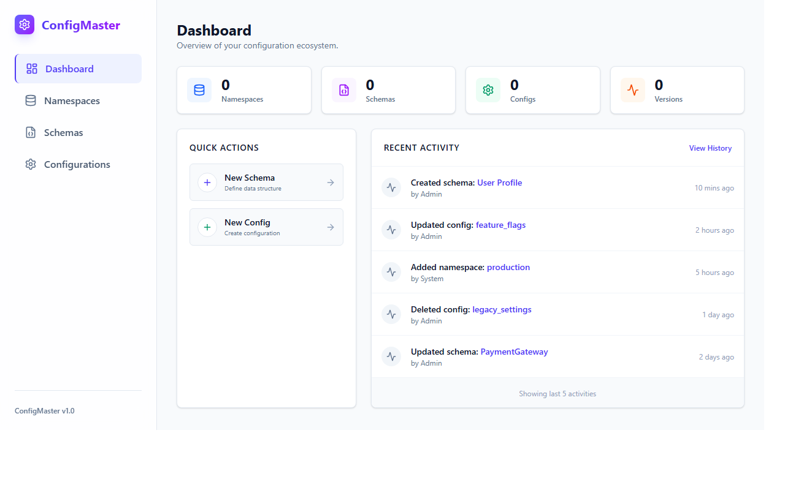
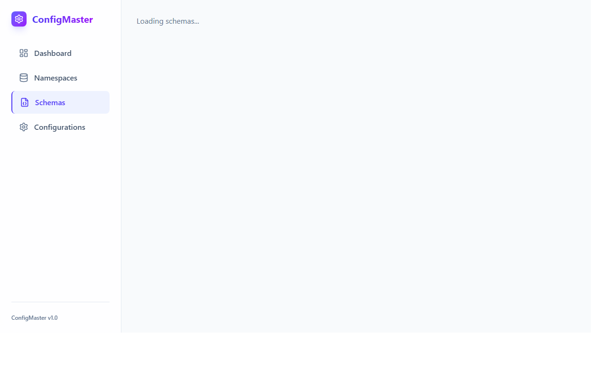
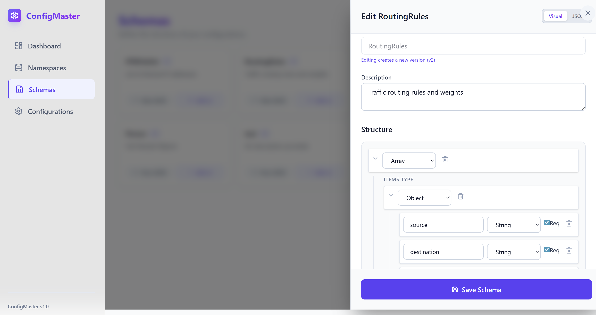
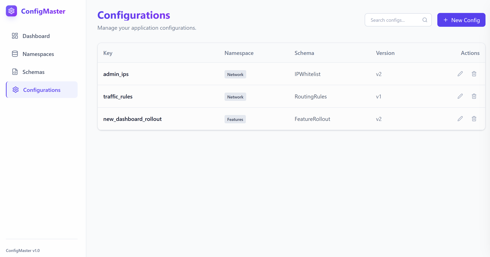

# Config Service

## 🚀 Quick Start

### 1. Start the Backend
```bash
# Install dependencies
pip install -r requirements.txt

# Run the server
python -m uvicorn app.main:app --reload --port 8001
```

### 2. Start the Frontend (New!)
```bash
cd frontend
npm install
npm run dev
```
Open [http://localhost:5173](http://localhost:5173) to view the new UI.

---

# Generic Configuration Service

A powerful, schema-driven configuration management platform designed to be generic, scalable, and extensible.

## 📖 Overview

In modern software architecture, managing configurations across multiple services, environments, and platforms is a common challenge. Hardcoding configurations or creating custom database tables for every new config type leads to technical debt and maintenance nightmares.

The **Generic Configuration Service** solves this by adopting a **"Schema-First"** approach. Instead of writing code to support a new configuration type, you simply define its structure using **JSON Schema**. The system automatically generates the necessary API validation logic and UI forms to manage it.

## 🎯 Requirements

### Functional Requirements
1.  **Generic Data Support**: Must support any type of configuration data (Key-Value, Lists, Tables, Hierarchies, Complex Nested Objects).
2.  **Namespace Management**: Ability to group configurations logically (e.g., by Service, Team, or Environment).
3.  **Schema Definition**: Users must be able to define the structure of their configurations dynamically.
4.  **Validation**: All configuration data must be strictly validated against its defined schema before storage.
5.  **Dynamic UI**: The user interface must automatically adapt to the defined schema, providing appropriate inputs (Text, Number, Dropdown, List Builders, etc.) without custom frontend code.
6.  **Versioning**: Track changes to configurations over time.

### Non-Functional Requirements
1.  **Extensibility**: Adding a new config type should require **Zero Code Changes**.
2.  **Usability**: Premium, user-friendly interface with visual editors for both Schemas and Configs.
3.  **Portability**: Lightweight and easy to deploy (Docker-ready).

## 🏗️ Solution Approach

### Architecture
The system is built as a modern full-stack web application:

-   **Backend**: **FastAPI** (Python) serves as the REST API layer. It handles CRUD operations and uses the `jsonschema` library to perform strict validation of configuration payloads against their stored schemas.
-   **Database**: **SQLite** (via **SQLAlchemy**) provides a lightweight, portable storage engine. Data is stored as JSON blobs, allowing for infinite flexibility while maintaining relational integrity for metadata (Namespaces, Schemas).
-   **Frontend**: **React 18** + **Vite** + **Tailwind CSS**. It features a modern, clean **Light Theme** UI with a powerful **Visual Schema Editor** and dynamic form generation using `@rjsf/core`.

### Key Features
-   **Schema-First Design**: Define `{"type": "boolean"}` and get a checkbox. Define an `enum` and get a dropdown. Define an `array` of `objects` and get a dynamic table editor.
-   **Visual Schema Editor**: Create complex nested schemas without writing a single line of JSON.
-   **Version Control**: Schemas are immutable and versioned. Editing a schema creates a new version, ensuring existing configs never break.
-   **Dynamic Forms**: Configuration forms are automatically generated from your schemas.
-   **Search & Discovery**: Instantly find configs by key, namespace, or schema.
-   **Validation**: Strict server-side validation ensures data integrity.

## 📸 Screenshots

### Dashboard


### Schemas




### Configs



## 🚀 Getting Started

### Prerequisites
-   Python 3.8+
-   `pip`

### Installation

1.  **Clone the repository**
    ```bash
    git clone <repository-url>
    cd config-app
    ```

2.  **Install Dependencies**
    ```bash
    pip install -r requirements.txt
    ```

3.  **Run the Server**
    ```bash
    python -m uvicorn app.main:app --reload --port 8000
    ```

4.  **Access the UI**
    Open [http://localhost:8000](http://localhost:8000) in your browser.

## 📚 Documentation

For a deep dive into the system architecture, backend models, and frontend component design, please refer to the [Architecture Documentation](docs/architecture.md).

## 🧪 Demo / Seed Data

To populate the database with complex examples (Lists, Tables, Hierarchies), run:

```bash
python seed_data.py
```

This will create:
-   **IP Whitelist** (List of Strings)
-   **Traffic Rules** (Table of Objects)
-   **Feature Rollout** (Deeply Nested Hierarchy)
