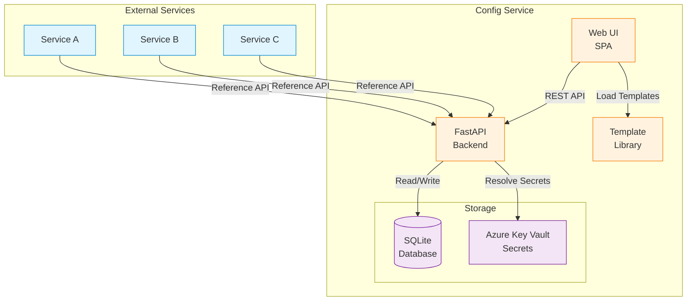
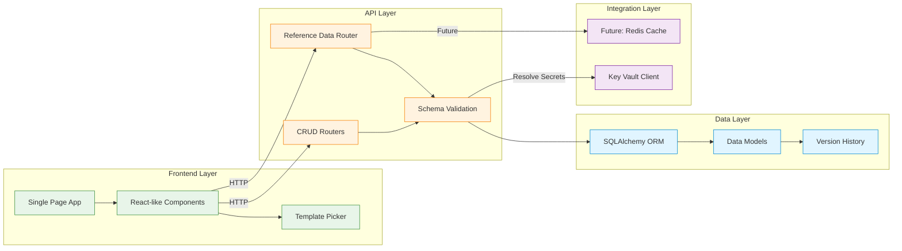
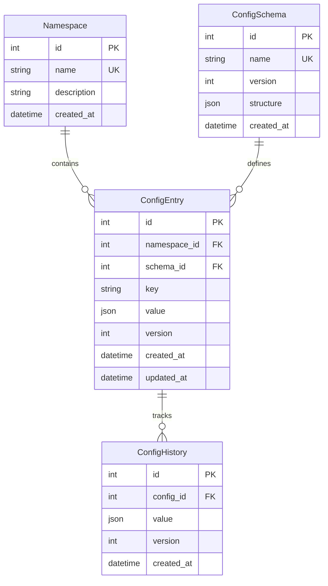
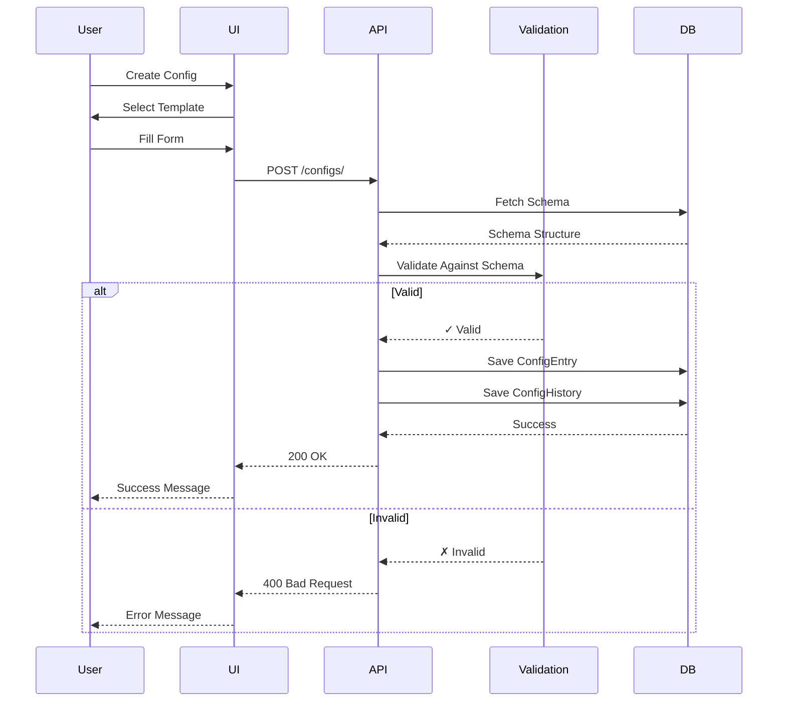
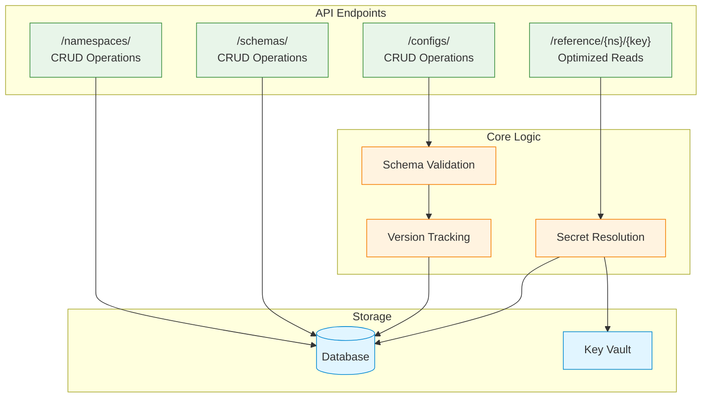
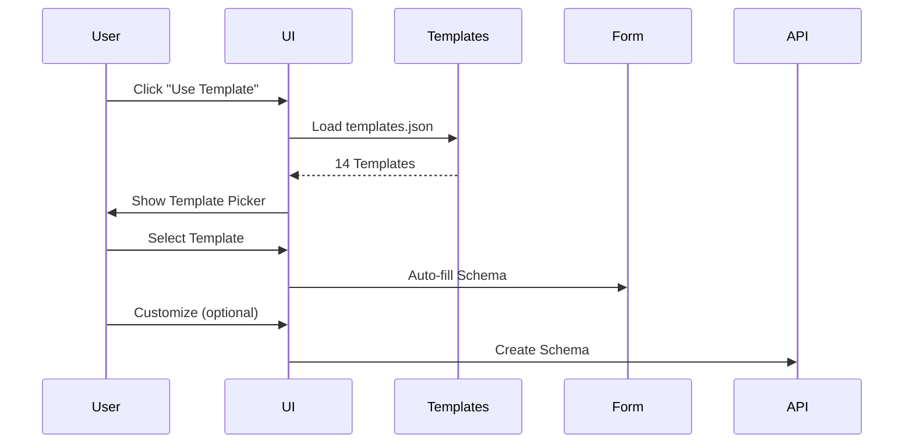
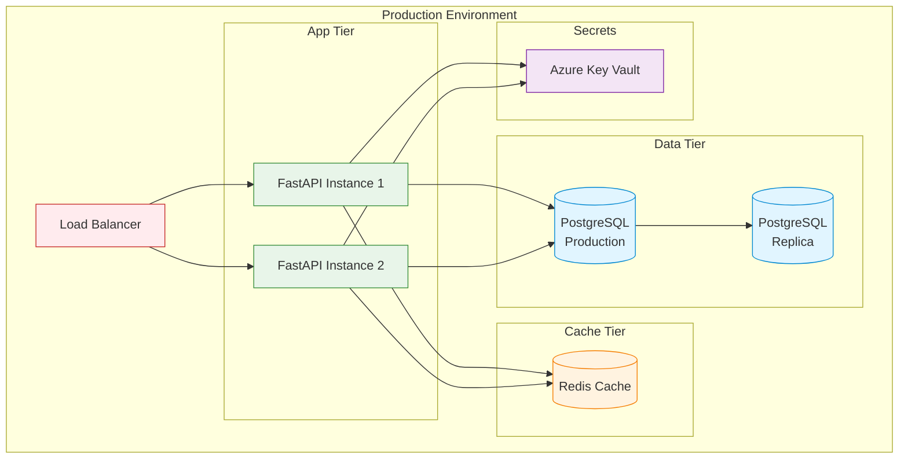

# Config Service - Complete Architecture Documentation

## Table of Contents
1. [Overview](#overview)
2. [System Architecture](#system-architecture)
3. [Data Model](#data-model)
4. [API Design](#api-design)
5. [Key Features](#key-features)
6. [Security & Best Practices](#security--best-practices)

---

## Overview

The Generic Configuration Service is a **schema-driven, zero-code configuration management platform** that enables centralized management of any configuration type without requiring code changes or database migrations.

### Core Principles

1. **Schema-First**: Define structure once using JSON Schema, use forever
2. **Zero-Code Extensibility**: Add new config types without touching code
3. **Reference Data Support**: Optimized APIs for FK lookups by external services
4. **Version Controlled**: Full audit trail of all configuration changes
5. **Namespace Isolation**: Multi-tenant support via namespaces

### Key Differentiators

- ✅ **No database migrations needed** - JSON storage with schema validation
- ✅ **Template library** - 14+ pre-built schemas for common patterns
- ✅ **Reference data APIs** - Optimized endpoints for FK validation
- ✅ **Secret management** - Azure Key Vault integration
- ✅ **Multi-namespace** - Logical isolation for teams/services

---

## System Architecture

### High-Level Architecture



### Component Architecture



---

## Data Model

### Entity Relationship Diagram



### Data Model Explanation

**Namespace**
- Logical isolation unit (e.g., "platform", "mbd", "tsa")
- Groups related configurations
- Supports multi-tenancy

**ConfigSchema**
- Stores JSON Schema definition
- Validates configuration structure
- Versioned for schema evolution
- Examples: UseCases, MenuItems, LLMModels

**ConfigEntry**
- Actual configuration value (stored as JSON)
- Links to namespace and schema
- Unique constraint: (namespace_id, key)
- Versioned for tracking changes

**ConfigHistory**
- Audit trail of all changes
- Immutable history records
- Enables rollback capability

### Data Flow



---

## API Design

### API Architecture



### API Endpoints Overview

#### Core CRUD APIs

| Endpoint | Method | Purpose |
|----------|--------|---------|
| `/namespaces/` | GET | List all namespaces |
| `/namespaces/` | POST | Create namespace |
| `/schemas/` | GET | List all schemas |
| `/schemas/` | POST | Create schema |
| `/configs/` | GET | List all configs |
| `/configs/` | POST | Create config |
| `/configs/{id}` | GET | Get specific config |
| `/configs/{id}` | PUT | Update config |
| `/configs/{id}` | DELETE | Delete config |

#### Reference Data APIs (NEW)

| Endpoint | Method | Purpose | Use Case |
|----------|--------|---------|----------|
| `/reference/{namespace}/{key}` | GET | Get full config | Fetch all usecases |
| `/reference/{namespace}/{key}/lookup/{id}` | GET | Lookup by ID | Validate FK reference |
| `/reference/{namespace}/{key}/search` | GET | Search in config | Find items by text |

### API Request/Response Examples

#### Create Schema from Template

```http
POST /schemas/
Content-Type: application/json

{
  "name": "UseCases",
  "structure": {
    "type": "array",
    "items": {
      "type": "object",
      "properties": {
        "usecase_id": {"type": "string"},
        "name": {"type": "string"},
        "status": {"type": "string", "enum": ["active", "inactive"]}
      },
      "required": ["usecase_id", "name", "status"]
    }
  }
}
```

**Response:**
```json
{
  "id": 1,
  "name": "UseCases",
  "version": 1,
  "structure": {...},
  "created_at": "2025-11-27T20:00:00Z"
}
```

#### Create Configuration

```http
POST /configs/
Content-Type: application/json

{
  "namespace_id": 1,
  "schema_id": 1,
  "key": "active_usecases",
  "value": [
    {
      "usecase_id": "UC001",
      "name": "Customer Onboarding",
      "status": "active"
    }
  ]
}
```

**Response:**
```json
{
  "id": 1,
  "namespace_id": 1,
  "schema_id": 1,
  "key": "active_usecases",
  "value": [...],
  "version": 1,
  "created_at": "2025-11-27T20:00:00Z"
}
```

#### Reference Data: Lookup Item

```http
GET /reference/platform/active_usecases/lookup/UC001?id_field=usecase_id
```

**Response:**
```json
{
  "usecase_id": "UC001",
  "name": "Customer Onboarding",
  "status": "active"
}
```

---

## Key Features

### 1. Template System

**Purpose**: Accelerate schema creation with pre-built templates

**Templates Available:**
- Reference Data: UseCases, OrgHierarchy, LLMModels, ArtifactTypes, NodeTypes
- UI Configuration: MenuItems, MicrofrontendMetadata, MaintenanceMessages
- External Integration: ThirdPartyURLs
- Sensitive Data: SecretKeys, PostgreSQLConnection
- Workflow Config: UseCaseOnboarding, FederatedCatalog

**Usage Flow:**


### 2. Reference Data Pattern

**Problem**: Other services need to reference config data as foreign keys

**Solution**: Optimized `/reference/*` endpoints

**Example Use Case:**
```python
# Service A needs to validate usecase_id
def validate_usecase(usecase_id: str) -> bool:
    response = requests.get(
        f'{CONFIG_SERVICE}/reference/platform/active_usecases/lookup/{usecase_id}',
        params={'id_field': 'usecase_id'}
    )
    return response.status_code == 200
```

### 3. Secret Management

**Problem**: Storing sensitive data (passwords, API keys) securely

**Solution**: Azure Key Vault integration with `vault://` references

**Pattern:**
```json
{
  "database": "production",
  "password": "vault://db-prod-password"
}
```

**Resolution:**
```http
GET /reference/global/db_connection?resolve_vault=true
```

Returns actual password from Key Vault.

### 4. Version History

Every configuration change is tracked:
- Who changed it
- When it changed
- What the previous value was
- Enables rollback

---

## Security & Best Practices

### Security Features

1. **Secret Management**
   - Secrets stored in Azure Key Vault
   - Config stores references only
   - Optional resolution on-demand

2. **Validation**
   - JSON Schema validation enforced
   - Prevents invalid data
   - Type checking

3. **Audit Trail**
   - All changes logged
   - Immutable history
   - Compliance ready

### Best Practices

**For Schema Design:**
- Use templates as starting point
- Define required fields clearly
- Use enums for fixed values
- Add descriptions for documentation

**For Namespace Organization:**
- One namespace per team/service
- Platform namespace for shared configs
- Use meaningful names

**For Configuration Keys:**
- Use descriptive, unique keys
- Follow naming convention (e.g., snake_case)
- Group related configs

**For External Services:**
- Cache reference data locally
- Use lookup endpoints for FK validation
- Handle 404s gracefully

---

## Technology Stack

**Backend:**
- FastAPI (Python web framework)
- SQLAlchemy (ORM)
- SQLite (Database)
- Pydantic (Data validation)
- jsonschema (Schema validation)

**Frontend:**
- Vanilla JavaScript (ES6 modules)
- JSONEditor (Visual JSON editing)
- Modern CSS (Glassmorphism design)

**Integration:**
- Azure Key Vault (Secret management)
- Future: Redis (Caching)

---

## Deployment Architecture



**Notes:**
- Current: SQLite (development)
- Production: Use PostgreSQL
- Add Redis for reference data caching
- Horizontal scaling via load balancer

---

## Next Steps

1. **Production Readiness**
   - Switch to PostgreSQL
   - Add Redis caching
   - Implement API authentication
   - Add rate limiting

2. **Enhanced Features**
   - Bulk import/export
   - Config comparison/diff
   - Approval workflows
   - Scheduled changes

3. **Monitoring**
   - API metrics
   - Usage analytics
   - Performance monitoring
   - Error tracking

---

For detailed API specifications, see [api-reference.md](./api-reference.md)  
For usage examples, see [usage-guide.md](./usage-guide.md)
