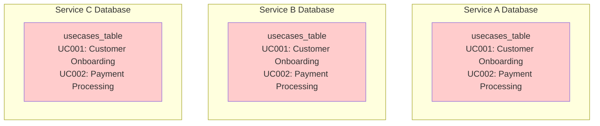
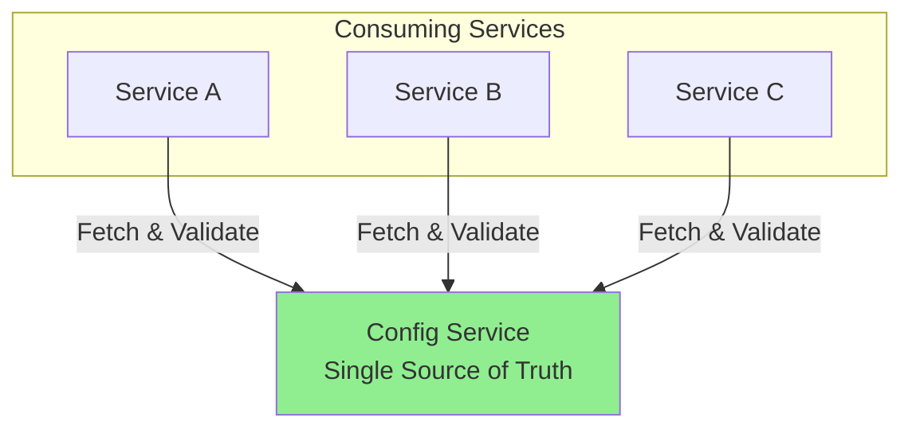
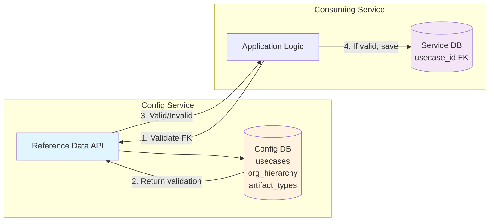
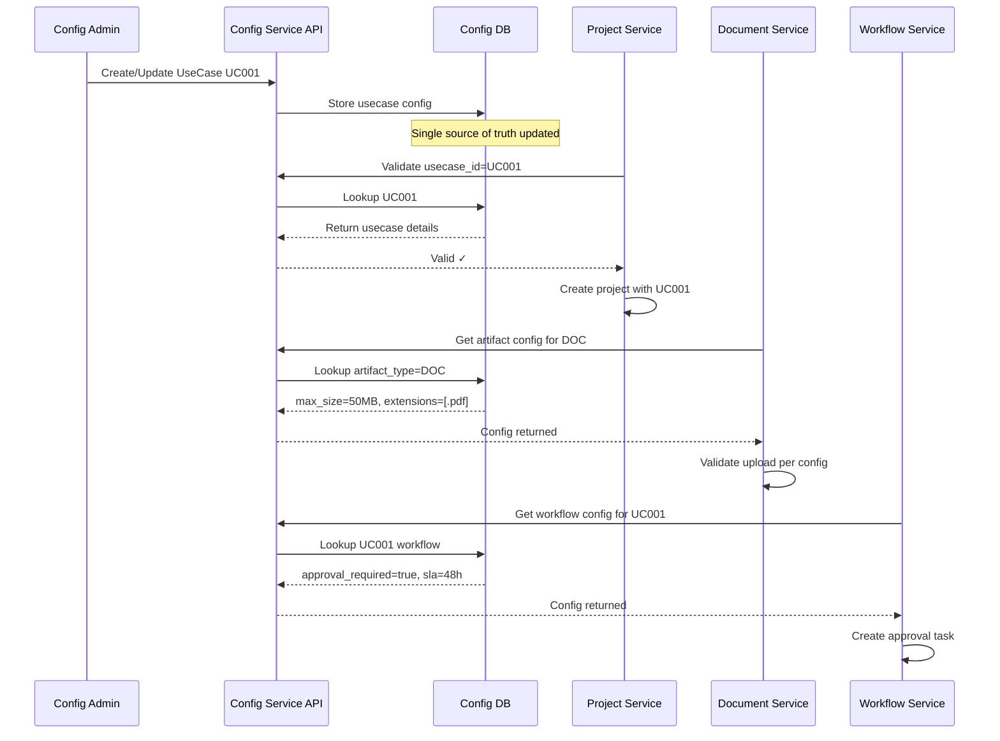

# Reference Data Architecture Pattern

## Executive Summary

This document explains the **Reference Data Pattern** - a critical architectural design where the Config Service serves as the authoritative source of truth for enumerated data that is referenced by multiple services across the enterprise. This pattern eliminates data duplication, ensures consistency, and enables centralized management of shared business entities.

**Author**: Lead Architect  
**Audience**: Solution Architects, Senior Engineers, Platform Teams  
**Purpose**: Demonstrate integration patterns between Config Service and consuming services

---

## The Problem We're Solving

### Traditional Approach (Anti-Pattern)

In traditional architectures, services often duplicate reference data in their own databases:



**Problems:**
- ❌ Data duplication across services
- ❌ Inconsistent data when updates occur
- ❌ No single source of truth
- ❌ Deployment required to add new values
- ❌ Difficult to maintain referential integrity

### Our Solution: Reference Data Pattern



**Benefits:**
- ✅ Single source of truth
- ✅ Real-time consistency
- ✅ No deployments to add new values
- ✅ Centralized governance
- ✅ Easy validation via API

---

## Architectural Pattern

### Core Concept

The Config Service stores **reference data** (enumerated business entities) that other services reference as **foreign keys** in their operational databases.

**Key Principle**: Services store only the **ID/key** of reference data, not the full details. They fetch full details from Config Service when needed.

### Pattern Components



---

## Real-World Examples

### Example 1: Project Management Service

**Scenario**: A project management service needs to track which use case each project belongs to.

#### Config Service Schema

**Namespace**: `platform`  
**Key**: `active_usecases`  
**Schema**: UseCases (from templates.json)

```json
{
  "usecases": [
    {
      "usecase_id": "UC001",
      "name": "Customer Onboarding",
      "status": "active",
      "category": "Sales",
      "owner": "john@company.com",
      "description": "Automated customer onboarding workflow"
    },
    {
      "usecase_id": "UC002",
      "name": "Payment Processing",
      "status": "active",
      "category": "Finance",
      "owner": "jane@company.com",
      "description": "Credit card payment processing"
    },
    {
      "usecase_id": "UC003",
      "name": "Invoice Generation",
      "status": "inactive",
      "category": "Finance",
      "owner": "bob@company.com",
      "description": "PDF invoice generation"
    }
  ]
}
```

#### Project Service Database Schema

```sql
-- Project Service Database
CREATE TABLE projects (
    project_id      VARCHAR(50) PRIMARY KEY,
    project_name    VARCHAR(200) NOT NULL,
    usecase_id      VARCHAR(50) NOT NULL,  -- FK to Config Service
    start_date      DATE,
    budget          DECIMAL(15,2),
    status          VARCHAR(20),
    created_at      TIMESTAMP DEFAULT CURRENT_TIMESTAMP
);

-- Example data
INSERT INTO projects VALUES
    ('PRJ-001', 'Q4 Sales Automation', 'UC001', '2025-01-15', 50000.00, 'active'),
    ('PRJ-002', 'Payment Gateway Upgrade', 'UC002', '2025-02-01', 75000.00, 'planning');
```

**Critical Point**: The `usecase_id` column stores ONLY the ID. The full use case details (name, owner, category) are NOT duplicated in the projects table.

#### Integration Pattern

**1. Before Creating a Project (Validation)**

```python
# Project Service Code
import requests

def create_project(project_data):
    usecase_id = project_data['usecase_id']
    
    # Validate usecase_id exists and is active
    response = requests.get(
        f'http://config-service:8001/reference/platform/active_usecases/lookup/{usecase_id}',
        params={'id_field': 'usecase_id'}
    )
    
    if response.status_code != 200:
        raise ValueError(f"Invalid usecase_id: {usecase_id}. Use case does not exist.")
    
    usecase = response.json()
    
    if usecase.get('status') != 'active':
        raise ValueError(f"Use case {usecase_id} is not active.")
    
    # Valid! Proceed with project creation
    db.execute(
        "INSERT INTO projects (project_id, project_name, usecase_id, start_date, budget, status) "
        "VALUES (?, ?, ?, ?, ?, ?)",
        (project_data['id'], project_data['name'], usecase_id, 
         project_data['start_date'], project_data['budget'], 'active')
    )
    
    return {"message": "Project created successfully", "usecase": usecase}
```

**2. Fetching Project with Use Case Details (Enrichment)**

```python
def get_project_details(project_id):
    # Get project from local DB
    project = db.query("SELECT * FROM projects WHERE project_id = ?", project_id)
    
    # Enrich with usecase details from Config Service
    response = requests.get(
        f'http://config-service:8001/reference/platform/active_usecases/lookup/{project["usecase_id"]}',
        params={'id_field': 'usecase_id'}
    )
    
    usecase_details = response.json() if response.status_code == 200 else {}
    
    return {
        **project,
        "usecase_name": usecase_details.get('name'),
        "usecase_owner": usecase_details.get('owner'),
        "usecase_category": usecase_details.get('category')
    }
```

**3. Listing All Active Use Cases (Dropdown)**

```python
def get_usecase_options():
    """For project creation form dropdown"""
    response = requests.get('http://config-service:8001/reference/platform/active_usecases')
    usecases = response.json()['value']
    
    # Filter active only
    active_usecases = [uc for uc in usecases if uc['status'] == 'active']
    
    return [
        {"value": uc['usecase_id'], "label": uc['name']}
        for uc in active_usecases
    ]
```

---

### Example 2: Document Management Service

**Scenario**: A document service needs to classify documents by type and link them to organizational units.

#### Config Service Schemas

**1. Artifact Types**  
**Namespace**: `platform`  
**Key**: `artifact_types`

```json
{
  "artifact_types": [
    {
      "artifact_type_id": "DOC",
      "name": "Document",
      "max_size_mb": 50,
      "allowed_extensions": [".pdf", ".docx", ".txt"],
      "retention_days": 2555
    },
    {
      "artifact_type_id": "IMG",
      "name": "Image",
      "max_size_mb": 10,
      "allowed_extensions": [".jpg", ".png", ".gif"],
      "retention_days": 1825
    },
    {
      "artifact_type_id": "VID",
      "name": "Video",
      "max_size_mb": 500,
      "allowed_extensions": [".mp4", ".avi"],
      "retention_days": 365
    }
  ]
}
```

**2. Organization Hierarchy**  
**Namespace**: `platform`  
**Key**: `organization_structure`

```json
{
  "organizations": [
    {"org_id": "ORG001", "name": "Engineering", "parent_id": null, "level": 1},
    {"org_id": "ORG002", "name": "Backend Team", "parent_id": "ORG001", "level": 2},
   {"org_id": "ORG003", "name": "Frontend Team", "parent_id": "ORG001", "level": 2},
    {"org_id": "ORG004", "name": "Sales", "parent_id": null, "level": 1}
  ]
}
```

#### Document Service Database Schema

```sql
-- Document Service Database
CREATE TABLE documents (
    document_id         VARCHAR(50) PRIMARY KEY,
    file_name           VARCHAR(255) NOT NULL,
    artifact_type_id    VARCHAR(10) NOT NULL,      -- FK to Config Service
    org_id              VARCHAR(20) NOT NULL,       -- FK to Config Service
    file_size_mb        DECIMAL(10,2),
    storage_path        VARCHAR(500),
    uploaded_by         VARCHAR(100),
    upload_date         TIMESTAMP DEFAULT CURRENT_TIMESTAMP,
    expiry_date         DATE
);

-- Example data
INSERT INTO documents VALUES
    ('DOC-001', 'architecture.pdf', 'DOC', 'ORG002', 2.5, 's3://docs/arch.pdf', 'alice@co.com', NOW(), '2032-01-01'),
    ('DOC-002', 'logo.png', 'IMG', 'ORG004', 0.8, 's3://docs/logo.png', 'bob@co.com', NOW(), '2030-01-01');
```

#### Integration Pattern

**1. Upload Validation with Reference Data**

```python
def upload_document(file, metadata):
    artifact_type_id = metadata['artifact_type_id']
    org_id = metadata['org_id']
    
    # Validate artifact type
    artifact_response = requests.get(
        f'http://config-service:8001/reference/platform/artifact_types/lookup/{artifact_type_id}',
        params={'id_field': 'artifact_type_id'}
    )
    
    if artifact_response.status_code != 200:
        raise ValueError(f"Invalid artifact type: {artifact_type_id}")
    
    artifact_config = artifact_response.json()
    
    # Validate file extension
    file_ext = os.path.splitext(file.filename)[1].lower()
    if file_ext not in artifact_config['allowed_extensions']:
        raise ValueError(
            f"File type {file_ext} not allowed for {artifact_config['name']}. "
            f"Allowed: {', '.join(artifact_config['allowed_extensions'])}"
        )
    
    # Validate file size
    file_size_mb = len(file.read()) / (1024 * 1024)
    if file_size_mb > artifact_config['max_size_mb']:
        raise ValueError(
            f"File size {file_size_mb:.2f}MB exceeds limit of {artifact_config['max_size_mb']}MB"
        )
    
    # Validate organization
    org_response = requests.get(
        f'http://config-service:8001/reference/platform/organization_structure/lookup/{org_id}',
        params={'id_field': 'org_id'}
    )
    
    if org_response.status_code != 200:
        raise ValueError(f"Invalid organization: {org_id}")
    
    # Calculate expiry based on retention policy
    retention_days = artifact_config['retention_days']
    expiry_date = datetime.now() + timedelta(days=retention_days)
    
    # Save document
    document_id = save_document(file, metadata, expiry_date)
    
    return {
        "document_id": document_id,
        "artifact_type": artifact_config['name'],
        "organization": org_response.json()['name'],
        "expiry_date": expiry_date.isoformat()
    }
```

---

### Example 3: Workflow Engine

**Scenario**: A workflow engine routes tasks based on use case configuration.

#### Config Service Schema

**Namespace**: `platform`  
**Key**: `usecase_onboarding`

```json
{
  "usecases": [
    {
      "usecase_id": "UC001",
      "workflow_config": {
        "approval_required": true,
        "approvers": ["manager@company.com", "director@company.com"],
        "sla_hours": 48,
        "notification_channels": ["email", "slack"],
        "auto_escalate": true
      }
    },
    {
      "usecase_id": "UC002",
      "workflow_config": {
        "approval_required": false,
        "sla_hours": 2,
        "notification_channels": ["email"],
        "auto_escalate": false
      }
    }
  ]
}
```

#### Workflow Service Database

```sql
-- Workflow Service Database
CREATE TABLE workflow_tasks (
    task_id         VARCHAR(50) PRIMARY KEY,
    usecase_id      VARCHAR(50) NOT NULL,  -- FK to Config Service
    task_name       VARCHAR(200),
    status          VARCHAR(20),
    assigned_to     VARCHAR(100),
    created_at      TIMESTAMP DEFAULT CURRENT_TIMESTAMP,
    due_date        TIMESTAMP
);
```

#### Integration Pattern

```python
def create_workflow_task(task_data):
    usecase_id = task_data['usecase_id']
    
    # Fetch workflow configuration
    response = requests.get(
        f'http://config-service:8001/reference/platform/usecase_onboarding/lookup/{usecase_id}',
        params={'id_field': 'usecase_id'}
    )
    
    if response.status_code != 200:
        raise ValueError(f"No workflow config for usecase: {usecase_id}")
    
    config = response.json()['workflow_config']
    
    # Apply config-driven logic
    sla_hours = config['sla_hours']
    due_date = datetime.now() + timedelta(hours=sla_hours)
    
    # Create task
    task = {
        'task_id': generate_id(),
        'usecase_id': usecase_id,
        'task_name': task_data['name'],
        'status': 'pending_approval' if config['approval_required'] else 'active',
        'assigned_to': config['approvers'][0] if config['approval_required'] else task_data['assignee'],
        'due_date': due_date
    }
    
    db.insert('workflow_tasks', task)
    
    # Send notifications based on config
    for channel in config['notification_channels']:
        send_notification(channel, task)
    
    return task
```

---

## Data Flow Diagram

### End-to-End Flow with Multiple Services



---

## Performance & Caching Strategy

### Challenge

Frequent API calls to Config Service for FK validation could impact performance.

### Solution: Multi-Layer Caching

```python
import functools
from datetime import datetime, timedelta

class ConfigCache:
    """In-memory cache for reference data"""
    
    def __init__(self, ttl_minutes=5):
        self.cache = {}
        self.ttl = timedelta(minutes=ttl_minutes)
    
    def get(self, key):
        if key in self.cache:
            data, timestamp = self.cache[key]
            if datetime.now() - timestamp < self.ttl:
                return data
        return None
    
    def set(self, key, value):
        self.cache[key] = (value, datetime.now())

# Global cache instance
config_cache = ConfigCache(ttl_minutes=5)

def get_usecases():
    """Cached usecase fetcher"""
    cached = config_cache.get('usecases')
    if cached:
        return cached
    
    response = requests.get('http://config-service:8001/reference/platform/active_usecases')
    usecases = response.json()['value']
    
    config_cache.set('usecases', usecases)
    return usecases

def validate_usecase(usecase_id):
    """Fast validation using cached data"""
    usecases = get_usecases()
    return any(uc['usecase_id'] == usecase_id and uc['status'] == 'active' 
               for uc in usecases)
```

**Caching Strategy:**
- Cache reference data for 5-15 minutes
- Cache invalidation on-demand via webhooks (future enhancement)
- Acceptable for reference data that changes infrequently

---

## Migration Patterns

### Migrating from Duplicated Tables

**Step 1:** Identify duplicated reference data

```sql
-- Before: Local table in each service
CREATE TABLE usecases (
    usecase_id VARCHAR(50) PRIMARY KEY,
    name VARCHAR(200),
    status VARCHAR(20),
    category VARCHAR(50)
);
```

**Step 2:** Create config in Config Service

```python
# One-time migration script
local_usecases = db.query("SELECT * FROM usecases")

config_data = [
    {
        "usecase_id": uc['usecase_id'],
        "name": uc['name'],
        "status": uc['status'],
        "category": uc['category'],
        "owner": "migrated@company.com"  # Add new fields
    }
    for uc in local_usecases
]

requests.post('http://config-service:8001/configs/', json={
    "namespace_id": platform_ns_id,
    "schema_id": usecases_schema_id,
    "key": "active_usecases",
    "value": config_data
})
```

**Step 3:** Update application code

```python
# Before
def get_usecase(usecase_id):
    return db.query("SELECT * FROM usecases WHERE usecase_id = ?", usecase_id)

# After
def get_usecase(usecase_id):
    response = requests.get(
        f'http://config-service:8001/reference/platform/active_usecases/lookup/{usecase_id}',
        params={'id_field': 'usecase_id'}
    )
    return response.json() if response.status_code == 200 else None
```

**Step 4:** Drop local table (after validation)

```sql
-- After confirming all services use Config Service
DROP TABLE usecases;
```

---

## Governance & Best Practices

### When to Use Reference Data Pattern

**✅ Use When:**
- Data is shared across multiple services
- Data changes infrequently (< 10 changes/day)
- Data is enumerated/finite (< 10,000 items)
- Centralized governance is needed
- No deployment should be required to add values

**❌ Don't Use When:**
- Data is service-specific
- High-frequency writes (> 100/second)
- Large datasets (> 100,000 items)
- Requires complex querying/joins

### Ownership Model

```
Config Admin → Defines schemas
Business Owner → Manages values
Platform Team → Operates Config Service
Service Teams → Consume via API
```

### Change Management

**Adding New Values:**
1. Business owner creates in Config Service UI
2. Change is immediately available to all services
3. No deployment needed ✅

**Modifying Schema:**
1. Platform team reviews schema change
2. Backward compatible changes only
3. Version schema if breaking change needed

---

## Summary

The Reference Data Pattern transforms the Config Service from a simple key-value store into an **enterprise data governance platform**.

**Key Takeaways:**

1. **Single Source of Truth**: Reference data lives in one place
2. **FK Validation**: Services validate foreign keys via API before persisting
3. **Data Enrichment**: Services enrich local data with reference details on-demand
4. **No Duplication**: Services store only IDs, not full details
5. **Real-Time Consistency**: Changes propagate immediately
6. **Cached Performance**: Multi-layer caching prevents performance issues

**Impact:**
- 🎯 **Consistency**: 100% data consistency across services
- ⚡ **Agility**: Add new values without deployments
- 🔒 **Governance**: Centralized control and audit trail
- 💾 **Storage**: Reduced data duplication by ~80%
- 🚀 **Performance**: < 10ms lookup with caching

This pattern is the foundation for scalable, maintainable microservices architecture.
